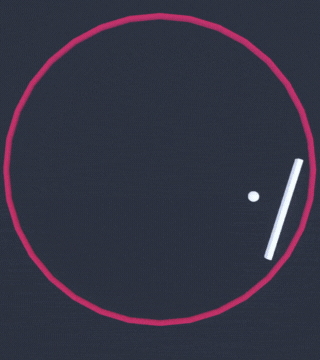
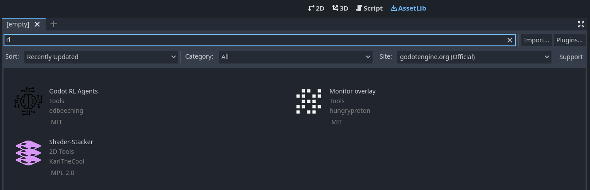
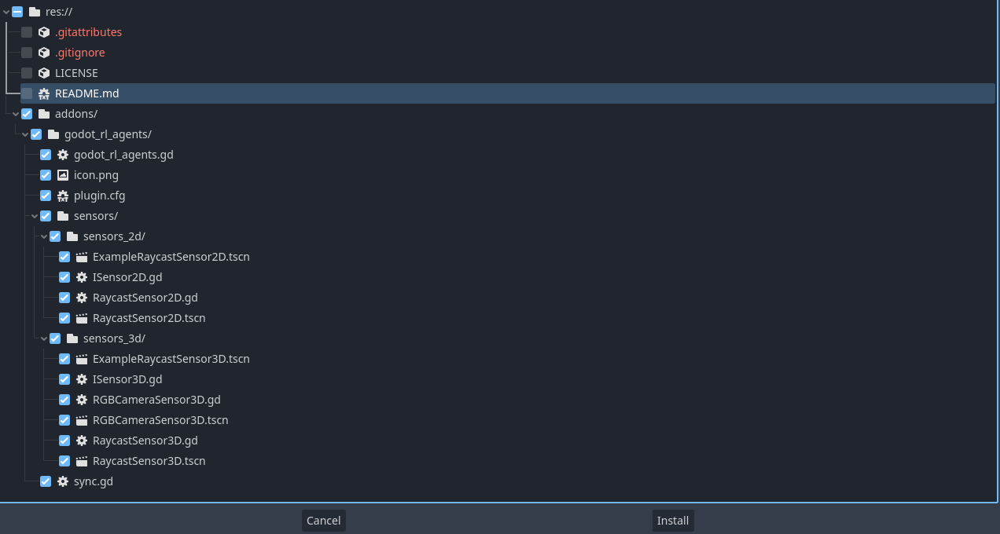
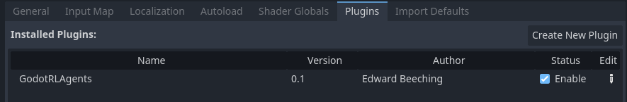
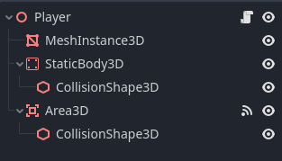
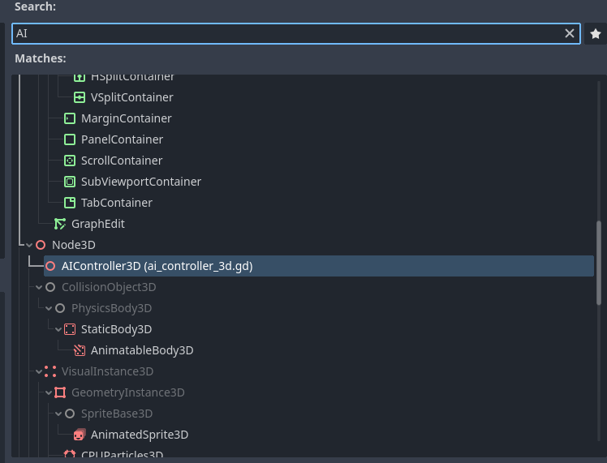

# Godot RL Agents Documentation

This documentation is provided by 
[Godot RL Agents - Hugging Face Deep RL Course](https://huggingface.co/learn/deep-rl-course/en/unitbonus3/godotrl) and 
[Godot - RL Agent ADV Stable Baselines 3](https://github.com/edbeeching/godot_rl_agents/blob/main/docs/ADV_STABLE_BASELINES_3.md)
and slightly modified in its structure. Check the links provided for official documentation

## Table of Contents

## 1. [Godot RL Agents](#godot-rl-agents)
### 1.1 [Introduction](#introduction-to-godot-rl-agents)
### 1.2 [Installation](#install-godot-rl-agents)
### 1.3 [Create a Custom Environment](#Create-a-custom-RL-environment-with-Godot-RL-Agents)
#### 1.3.1 [Install the Godot Engine](#install-the-godot-engine)
#### 1.3.2 [Loading the starter project](#loading-the-starter-project)
#### 1.3.3 [Installing the Godot RL Agents plugin](#installing-the-godot-rl-agents-plugin)
#### 1.3.4 [Adding the AI controller](#adding-the-ai-controller)
### 1.4 [Exporting and loading your trained agent in onnx format](#Exporting-and-loading-your-trained-agent-in-onnx-format)
## 2. [Stable Baselines 3](#stable-baselines-3)
### 2.1 [Introduction](#introduction-to-stable-baselines-3)
### 2.2 [Basic Environment Usage](#basic-environment-usage)
### 2.3 [SB3 Example script usage](#sb3-example-script-usage)


## Godot RL Agents

### Introduction to Godot RL Agents

Godot RL Agents is an Open Source package that allows video game creators, AI researchers, and hobbyists the opportunity
to learn complex behaviors for their NPC or agents.

The library provides:
* An interface between games created in the Godot Engine and Machine Learning algorithms running in Python
* Wrappers for four well known rl frameworks: StableBaselines3, CleanRL, Sample Factory and Ray RLLib
* Support for memory-based agents with LSTM or attention based interfaces
* Support for 2D and 3D games
* A suite of AI sensors to augment your agent’s capacity to observe the game world
* Godot and Godot RL Agents are completely free and open source under a very permissive MIT license. No strings attached, 
no royalties, nothing.

### Install Godot RL Agents

```
pip install godot-rl
```

### Create a custom RL environment with Godot RL Agents

In this section, you will learn how to create a custom environment in the Godot Game Engine and then implement an AI 
controller that learns to play with Deep Reinforcement Learning.

The example game we create today is simple, but shows off many of the features of the Godot Engine and the Godot 
RL Agents library. You can then dive into the examples for more complex environments and behaviors.

The environment we will be building today is called Ring Pong, the game of pong but the pitch is a ring and the paddle 
moves around the ring. The objective is to keep the ball bouncing inside the ring.



#### Install the Godot Engine 

The Godot game engine is an open source tool for the creation of video games, tools and user interfaces.

Godot Engine is a feature-packed, cross-platform game engine designed to create 2D and 3D games from a unified 
interface. It provides a comprehensive set of common tools, so users can focus on making games without having to 
reinvent the wheel. Games can be exported in one click to a number of platforms, including the major desktop platforms 
(Linux, macOS, Windows) as well as mobile (Android, iOS) and web-based (HTML5) platforms.

In order to create games in Godot, you must first download the editor. Godot RL Agents supports the latest version of 
Godot: 4.0.

#### Loading the starter project

We provide two versions of the codebase:
* [A starter project, to download and follow along for this tutorial](https://drive.google.com/file/d/1C7xd3TibJHlxFEJPBgBLpksgxrFZ3D8e/view?usp=share_link)
* [A final version of the project, for comparison and debugging](https://drive.google.com/file/d/1k-b2Bu7uIA6poApbouX4c3sq98xqogpZ/view?usp=share_link)

To load the project, in the Godot Project Manager click Import, navigate to where the files are located and load the 
project.godot file.

If you press F5 or play in the editor, you should be able to play the game in human mode. 
There are several instances of the game running, this is because we want to speed up training our 
AI agent with many parallel environments

#### Installing the Godot RL Agents plugin

The Godot RL Agents plugin can be installed from the GitHub repo or with the Godot Asset Lib in the editor.
* First click on the AssetLib and search for “rl”

  

* Then click on Godot RL Agents, click Download and unselect the `LICENSE` and `README`  files. Then click install.

  

* The Godot RL Agents plugin is now downloaded to your machine. Now click on Project → Project settings and enable the addon:

  

#### Adding the AI controller

We now want to add an AI controller to our game. 
Open the `player.tscn` scene, on the left you should see a hierarchy of nodes that looks like this:



* Right-click the Player node and click Add Child Node. There are many nodes listed here, 
search for AIController3D and create it. 

  

* The AI Controller Node should have been added to the scene tree, next to it is a scroll. 
Click on it to open the script that is attached to the AIController. 
The Godot game engine uses a scripting language called GDScript, which is syntactically similar to python. 
The script contains methods that need to be implemented in order to get our AI controller working.

    ```
    #-Methods that need implementing using the "extend script" option in Godot-#
    
    func get_obs() -> Dictionary:
        assert(false, "the get_obs method is not implemented when extending from ai_controller")
        return {"obs":[]}
    
    func get_reward() -> float:
        assert(false, "the get_reward method is not implemented when extending from ai_controller")
        return 0.0
    
    func get_action_space() -> Dictionary:
        assert(false, "the get get_action_space method is not implemented when extending from ai_controller")
        return {
            "example_actions_continous" : {
                "size": 2,
                "action_type": "continuous"
            },
            "example_actions_discrete" : {
                "size": 2,
                "action_type": "discrete"
            },
            }
    
    func set_action(action) -> void:
        assert(false, "the get set_action method is not implemented when extending from ai_controller")
    #--------------------------------------------------------------------------#
    ```

* In order to implement these methods, we will need to create a class that inherits from AIController3D. 
This is easy to do in Godot, and is called “extending” a class.

* Right-click the AIController3D Node and click “Extend Script” and call the new script `controller.gd`. 
You should now have an almost empty script file that looks like this

    ```
    extends AIController3D
    
    # Called when the node enters the scene tree for the first time.
    func _ready():
        pass # Replace with function body.
    
    # Called every frame. 'delta' is the elapsed time since the previous frame.
    func _process(delta):
        pass
    
    We will now implement the 4 missing methods, delete this code, and replace it with the following:
    
    extends AIController3D
    
    # Stores the action sampled for the agent's policy, running in python
    var move_action : float = 0.0
    
    func get_obs() -> Dictionary:
        # get the balls position and velocity in the paddle's frame of reference
        var ball_pos = to_local(_player.ball.global_position)
        var ball_vel = to_local(_player.ball.linear_velocity)
        var obs = [ball_pos.x, ball_pos.z, ball_vel.x/10.0, ball_vel.z/10.0]
    
        return {"obs":obs}
    
    func get_reward() -> float:
        return reward
    
    func get_action_space() -> Dictionary:
        return {
            "move_action" : {
                "size": 1,
                "action_type": "continuous"
            },
            }
    
    func set_action(action) -> void:
        move_action = clamp(action["move_action"][0], -1.0, 1.0)
    
    ```

* We have now defined the agent’s observation, which is the position and velocity of the ball in its local coordinate 
space. We have also defined the action space of the agent, which is a single continuous value ranging from -1 to +1.

* The next step is to update the Player’s script to use the actions from the AIController, edit the Player’s script by
clicking on the scroll next to the player node, update the code in Player.gd to the following:

    ```
    extends Node3D
    
    @export var rotation_speed = 3.0
    @onready var ball = get_node("../Ball")
    @onready var ai_controller = $AIController3D
    
    func _ready():
        ai_controller.init(self)
    
    func game_over():
        ai_controller.done = true
        ai_controller.needs_reset = true
    
    func _physics_process(delta):
        if ai_controller.needs_reset:
            ai_controller.reset()
            ball.reset()
            return
    
        var movement : float
        if ai_controller.heuristic == "human":
            movement = Input.get_axis("rotate_anticlockwise", "rotate_clockwise")
        else:
            movement = ai_controller.move_action
        rotate_y(movement*delta*rotation_speed)
    
    func _on_area_3d_body_entered(body):
        ai_controller.reward += 1.0
    ```

* We now need to synchronize between the game running in Godot and the neural network being trained in Python. 
Godot RL agents provides a node that does just that. Open the `train.tscn` scene, right-click on the root node, 
and click “Add child node”. Then, search for “sync” and add a Godot RL Agents Sync node. This node handles the 
communication between Python and Godot over TCP.

* You can run training live in the editor, by first launching the python training with `gdrl`.

  

* In this simple example, a reasonable policy is learned in several minutes. You may wish to speed up training, click on 
the Sync node in the train scene, and you will see there is a “Speed Up” property exposed in the editor.

* Try setting this property up to 8 to speed up training. This can be a great benefit on more complex environments, like 
the multi-player FPS we will learn about in the next chapter.

### Exporting and loading your trained agent in onnx format

The latest version of the library provides experimental support for onnx models with the Stable Baselines 3, rllib, 
and CleanRL training frameworks.

* First run train you agent using the sb3 example 
[(instructions for using the script)](#Train-a-model-for-100_000-steps-then-save-and-export-the-model), 
enabling the option `--onnx_export_path=GameModel.onnx`
* Then, using the mono version of the Godot Editor, add the onnx model path to the sync node. 
If you do not see this option you may need to download the plugin from source
* The game should now load and run using the onnx model. If you are having issues building the project, 
ensure that the contents of the .csproj and .sln files in you project match that those of the plugin source.

## Stable Baselines 3

### Introduction to Stable Baselines 3

Stable Baselines3 (SB3) is a set of reliable implementations of reinforcement learning algorithms in PyTorch. 
It is the next major version of Stable Baselines.

Main Features:
* Unified structure for all algorithms
* PEP8 compliant (unified code style)
* Documented functions and classes
* Tests, high code coverage and type hints
* Clean code
* Tensorboard support

### Install Stable Baselines 3

```
pip install godot-rl[sb3]
```

### Basic Environment Usage

Usage instructions for environments BallChase, FlyBy and JumperHard, provided by Godot-RL-Agents-Example.

#### Download the env

```
gdrl.env_from_hub -r edbeeching/godot_rl_<ENV_NAME>
chmod +x examples/godot_rl_<ENV_NAME>/bin/<ENV_NAME>.x86_64 # linux example
```

#### Train a model from scratch

```
gdrl --env=gdrl --env_path=examples/godot_rl_<ENV_NAME>/bin/<ENV_NAME>.x86_64 --experiment_name=Experiment_01 --viz
```

While the default options for sb3 work reasonably well. You may be interested in changing the hyperparameters.

We recommend taking the sb3 example and modifying to match your needs.

The example exposes more parameters for the user to configure, such as --speedup to run the environment faster than 
realtime and the --n_parallel to launch several instances of the game executable in order to accelerate training 
(not available for in-editor training).

### SB3 Example script usage

To use the example script, first move to the location where the downloaded script is in the console/terminal, and 
then try some of the example use cases below:

#### Train a model in editor

```
python stable_baselines3_example.py
```

#### Train a model using an exported environment

```
python stable_baselines3_example.py --env_path=path_to_executable
```

Note that the exported environment will not be rendered in order to accelerate training. 
If you want to display it, add the --viz argument.

#### Train an exported environment using 4 environment processes

```
python stable_baselines3_example.py --env_path=path_to_executable --n_parallel=4
```

#### Train an exported environment using 8 times speedup

```
python stable_baselines3_example.py --env_path=path_to_executable --speedup=8
```

#### Set an experiment directory and name
You can optionally set an experiment directory and name to override the default. When saving checkpoints, 
you need to use a unique directory or name for each run (more about that below).

```
python stable_baselines3_example.py --experiment_dir="experiments" --experiment_name="experiment1"
```

#### Train a model for 100_000 steps then save and export the model

The exported .onnx model can be used by the Godot sync node to run inference from Godot directly, while the saved 
.zip model can be used to resume training later or run inference from the example script by adding --inference.

```
python stable_baselines3_example.py --timesteps=100_000 --onnx_export_path=model.onnx --save_model_path=model.zip
```
Note: If you interrupt/halt training using ctrl + c, it should save/export models before closing training 
(but only if you have included the corresponding arguments mentioned above). Using checkpoints (see below) 
is a safer way to keep progress.

#### Resume training from a saved .zip model
This will load the previously saved model.zip, and resume training for another 100 000 steps, 
so the saved model will have been trained for 200 000 steps in total. Note that the console log 
will display the total_timesteps for the last training session only, so it will show 100000 instead of 200000.

```
python stable_baselines3_example.py --timesteps=100_000 --save_model_path=model_200_000_total_steps.zip --resume_model_path=model.zip
```

#### Save periodic checkpoints

You can save periodic checkpoints and later resume training from any checkpoint using the same CL argument as above, 
or run inference on any checkpoint just like with the saved model. Note that you need to use a unique experiment_name 
or experiment_dir for each run so that checkpoints from one run won't overwrite checkpoints from another run. 
Alternatively, you can remove the folder containing checkpoints from a previous run if you don't need them anymore.

E.g. train for a total of 2 000 000 steps with checkpoints saved at every 50 000 steps:

```
python stable_baselines3_example.py --experiment_name=experiment1 --timesteps=2_000_000 --save_checkpoint_frequency=50_000
```

Checkpoints will be saved to logs\sb3\experiment1_checkpoints in the above case, the location is affected by --experiment_dir and --experiment_name.

#### Run inference on a saved model for 100_000 steps

You can run inference on a model that was previously saved using either --save_model_path or --save_checkpoint_frequency.

```
python stable_baselines3_example.py --timesteps=100_000 --resume_model_path=model.zip --inference
```

#### Use a linear learning rate schedule

By default, the learning rate will be constant throughout training. If you add --linear_lr_schedule, learning rate will decrease with the progress, and reach 0 at --timesteps value.

```
python stable_baselines3_example.py --timesteps=1_000_000 --linear_lr_schedule
```

