# Documentation: RL Godot Pedestrian Simulation

## Curriculum-Based Reinforcement Learning for Pedestrian Simulation

#### [Andrea Falbo](https://github.com/LilQuacky)
#### [Ruben Tenderini](https://github.com/Ruben-2828)

## Table of Contents

### 1. [Introduction](#introduction)
### 2. [Basic Nodes Used](#basic-node-used)
### 3. [Basic Components of Levels](#basic-components-of-levels)
### 4. [Pedestrian Components](#Pedestrian-Components)
### 5. [How to create a custom environment](#How-to-create-a-custom-environment)
### 6. [How to run](#How-to-run)
### 7  [How to insert an environment into a CV](#How-to-insert-an-environment-into-a-CV)

## Introduction

This documentation is designed to provide a detailed overview and practical uses of the project, highlighting all its 
features. Before proceeding with exploring this document, it is strongly recommended to consult the `README` file, 
paying particular attention to the "Setup" section. This section contains crucial information for the correct 
downloading and installation of dependencies necessary for the proper use of this tool.

Additionally, for a thorough understanding of the technical foundations and components used in the project, it is 
advisable to carefully read the documentation available in the docs folder. Among these, the `godot_documentation` 
is essential for understanding the basic components of the Engine used, while the `godot_rl_agents_documentation` is 
specifically focused on the application of Reinforcement Learning in Godot and the implementation of Stable Baselines 3 
through examples not related to this project. By following these guidelines, you will be able to maximize the
effectiveness and usage of the project in question.

## Basic Nodes Used

### StaticBody3D
StaticBody3D is a type of node in Godot Engine used to represent objects that do not move. It is not affected by forces 
such as gravity, but it can interact with other objects through collisions.

In our specific implementation, it has been used as the parent node for two main elements: Wall and Floor.

### Area3D
Area3D is a node in Godot Engine that represents a three-dimensional area in the game world. It is used to detect the 
presence of other objects or characters within it.

In our specific implementation, it has been used as the parent node for two main elements: Target and Spawn.

### CollisionShape3D
CollisionShape3D is a node used in Godot Engine to define the collision geometry for physical nodes like StaticBody3D 
or Area3D. This node is crucial for establishing the physical interactions of objects in the virtual world.

In our specific implementation, CollisionShape3D has been employed as a child node for all structural elements of the 
environments, such as floors, walls, target area, and spawn area. For each element, we configured the 'shape' property 
of the node as BoxShape, adjusting the dimensions according to the specific needs of each context.

### MeshInstance3D
MeshInstance3D is a node in Godot Engine that allows for the display of 3D meshes in the game environment, primarily 
for the visual representation of physical nodes like StaticBody3D or Area3D.

In our specific implementation, we have used MeshInstance3D as a child node for all structural elements of the 
environments, such as floors, walls, spawn area, and target area. For each element, we configured the 'mesh' property 
as BoxMesh to define the shape and then used the Material parameter to create the material of the element. We customize 
the color of the material by modifying the Color parameter in the Albedo section for each mesh.

### Label3D
In Godot Engine, Label3D is a node used to display text in a 3D scene. In our specific implementation, it has been used 
to show the reward of the specific environment at runtime.

### CharacterBody3D
CharacterBody3D is a specialized class for physical bodies designed to be controlled by the user. It is used for highly 
configurable physical bodies that need to move in specific ways and interact with the surrounding environment.

In our specific implementation, CharacterBody3D is employed to provide a representation of the character and to control 
its movement, orientation, and vision within the environments it is placed in.

### WorldEnvironment
WorldEnvironment is a node in Godot Engine used to control the global rendering environment settings in a 3D scene. 
Parameters such as lighting, sky color, fog, bokeh effect, and more can be adjusted.

### DirectionalLight3D
DirectionalLight3D is a node in Godot Engine used to simulate a directional light source in a 3D scene.

### Camera3D
Camera3D is a node in Godot Engine used to represent a three-dimensional camera in the game scene.

In our specific implementation, it has been used within TrainingScene to display one environment at a time through a 
top-down orthographic perspective.

### Sync 
Sync is not a node found in Godot Engine, but has been introduced by the Godot RL Agents library. Its purpose is to 
synchronize the scene running in Godot with the neural network trained in Python. This node manages the communication 
between Python and Godot over TCP.

## Basic Components of Levels

### Walls
- Description: A wall is a barrier that the agent cannot pass through.
- Structure: Contains a StaticBody3D node equipped with a MeshInstance3D and a CollisionShape3D.
- Identification: To be recognized as a wall, it must be part of the 'walls' group.

  

### Targets
- Description: A target is an objective that the agent must reach. There are two types of targets: intermediate and final. 
  - Intermediate Targets: Help guide the agent in complex environments where the final target is not directly visible. 
  The agent can pass through these. 
  - Final Targets: The ultimate goal that the agent strives to reach.
- Structure: Composed of an Area3D node with a MeshInstance3D and a CollisionShape3D.
- Identification: To be recognized as a target, it must be part of the 'targets' group.

  


### Spawn Area
- Description: The area within which the agent is generated at the start of an episode. It is flat and determines the
initial position and orientation of the agent, indicated by an arrow. 
- Structure: Consists of an Area3D that includes a CollisionShape3D, with two MeshInstance3D - one representing the area 
itself and another representing the arrow. 

  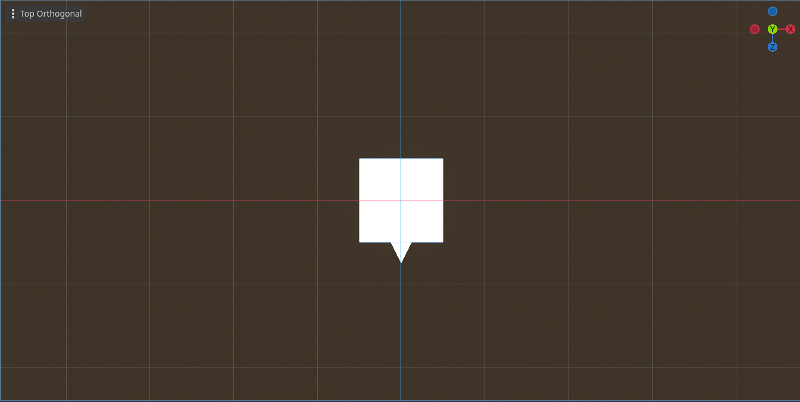

### Floor
- Description: Used to define the floor of the environment. The agent cannot pass through it. 
- Structure: Composed of an Area3D with a MeshInstance3d and a CollisionShape3D designed as a world boundary to create an 
infinite impassable plane.

  
  
## Pedestrian Components

### Pedestrian
The pedestrian is the agent in our environment that must reach the final target. It consists of a CharacterBody3D object 
with various child nodes: Armature, AnimationPlayer, AnimationTree, CollisionShape3D, AIController3D, RayCastSensor3D, 
and ProxemicArcNear. Armature is the 3D object imported from Blender that contains the graphics of the pawn, and together 
with AnimationPlayer and AnimationTree, it manages the various animations. CollisionShape3D is the capsule-shaped collision 
shape of the pawn. AIController3D and RayCastSensor3D are responsible for controlling the pawn and performing the 
necessary observations, respectively. 
The pedestrian has two parameters: Speed min for minimum speed and Speed Max for maximum speed.

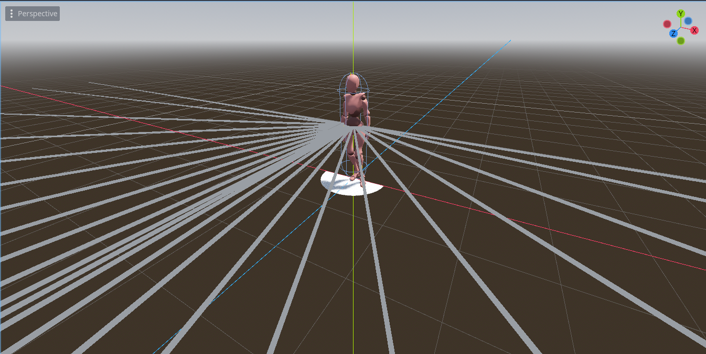

### AI Controller
The AI controller is the node responsible for managing the behavior of the pawn. It can specifically handle the speed 
and rotation of the agent. This node also handles obtaining the observations that will then be passed to Python for 
training. 

### Ray cast Sensor
This node is responsible for generating all the RayCast rays to perform observations. Its main parameters are Ray Length 
for the maximum length of the rays, Max Vision for the maximum angle to generate the rays, Alfa Init for the initial 
ray angle, and Delta to determine the interval between one ray and the next.

## How to create a custom environment

To create a customized environment, you can use the pre-existing elements found in the "objects" folder or create new 
elements as you wish. However, there are specific settings to follow for various purposes.

### Groups
Any wall or obstacle added to the custom environment must be placed in a group labeled ‘walls’ in the Groups attribute.
Any goal placed in the custom environment must be in a group labeled ‘targets’ in the Groups attribute.

To add an item to a group follow these steps:

* Click on the element within the scenario
* Open the node panel and enter the groups section
* Type walls or targets depending on the element and press the Add button

  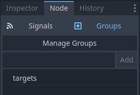

### Node Script
The parent node, which contains the entire scene, should have the script `level.gd` attached.
If you want the environment to mirror when the agent reaches the goal, attach the script `turn_level.gd`.

### Random Spawn Structure
To randomize the spawn position within a given area, follow this structure:
* Use a Node3D as the parent node for the spawn point and the area in which it can spawn. Attach the script 
`random_spawn.gd`. It’s recommended to rename it to RandomSpawn, but this is not mandatory.
*  Insert the node labeled Spawn as a child. Do not change the name.
*  Insert an Area3D node. It is not strictly necessary to rename it.
*  Inside the Area3D, insert a CollisionShape3D and set the size of the spawning area using a BoxShape. Rename this 
node to CollisionShapeSpawn.
* If you are interested in randomizing only the spawn rotation and not the position, 
you can create the CollisionShape3D with dimensions 0x0x0 and enable only the rotation randomization

  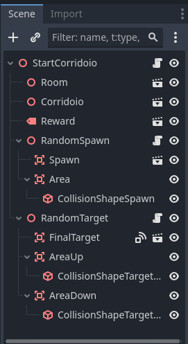

### Random Target Structure
To randomize the position of the final target within a given area, follow this structure:
* Use a Node3D as the parent node for the target and the area in which it can spawn. Attach the script 
`random_target.gd`. It’s recommended to rename it to RandomTarget, but this is not mandatory.
* Insert the node labeled FinalTarget as a child. Do not change the name.
* Insert an Area3D node. It is not strictly necessary to rename it.
* Inside the Area3D, insert a CollisionShape3D and set the size of the final target area using a BoxShape. 
Rename this node to CollisionShapeTarget.

### How to set random targets and random spawns
To enable randomization settings for targets or spawns, follow this instruction:
* Click on the parent node, either RandomSpawn or RandomTarget.
* On the right side, in the Inspector panel, customization parameters will appear within the Spawn Settings or 
Target Settings section.
* Check the parameters you want to enable.
If these parameters are not visible, ensure that the parent node has the attached script `random_spawn.gd` or 
`random_target.gd`.

  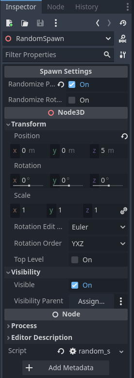

### How to insert an environment into a CV
To view the curriculum or add a new scenario, proceed as follows:

1. Open the desired scene using Godot's FileSystem, located in the lower left corner. Select the scene you want to
modify, such as `training_scene.tscn` or `testing_scene.tscn`.

2. Once the scene is open, use the Scene panel in the upper left corner to view the nodes that make up the scene. 
Click on the main node, which could be TrainingScene or TestingScene. This will display the node's attributes in the 
Inspector panel, located on the right side.

3. In the Inspector, locate the Levels attribute. Here you can decide how many and which scenarios to load, 
simply by clicking on "Add Element".

  

### How to change the termination parameters of an environment

To change the termination parameters of a specific environment, follow the steps below:

* Enter the scene you want to edit
* Click the parent node and make sure it attach script `level.gd` or `turn_level.gd`
* On the inspector panel on the right, change the 3 parameters as you wish

  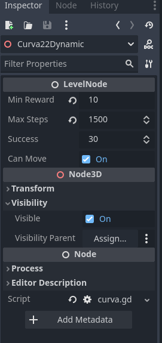

## How to run

### Commands for run

To run, make sure you've activated the environment with 
  ```
    conda activate environment_name
  ```
Then, type the command `gdrl`. Once you get a response from the command, execute the run by clicking the "run" 
button in the top right corner of the Godot Engine or by pressing F5.

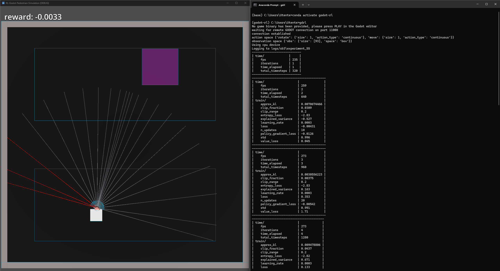

### How to speed up/slow down the run
To speed up or slow down the run, open the scene you want to modify and enter the Sync node. From here, on the right 
side in the Inspector panel, adjust the Speed Up field. Remember to rerun the scene as the changes do not take effect 
at runtime.

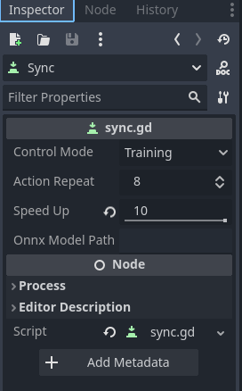

### How to view ray casts during the run

To visualize ray casts during execution, open the Debug menu in Godot Engine by clicking in the top-left corner and 
enable 'Visible Collision Shapes'. Remember to rerun the scene because the changes do not take effect at runtime.


### How to set batch size

In the `training_scene.tscn`, you can adjust the batch size to choose how many environments to create in parallel.


### Run the Test scene

Before running the test phase, it is necessary to export the trained agent in onnx format and load into the test scene.

#### Export

* Enter the path where you downloaded the project, for example `cd your/path/to/RL-Godot-Pedestrian-Simulation`
* Launch the sb3 script present in the scripts folder, specifying where to save the files. For example:

  ``` 
  python scripts/stable_baselines3_example.py --onnx_export_path=model/test1/model.onnx
  ``` 

* It is recommended to keep separate folders and increment them using an identifier such as `test[id]`
* For other save configurations, check `godot_rl_agents_documentation`

#### Load

To load the trained agent follow these steps:

* Check that you have also downloaded the mono version of Godot from [here](https://godotengine.org/download/windows/) 
by clicking on the `Godot Engine - .NET` button
* Attach a dummy file to an element of your scene in C# language. Then detach the script and delete the script

  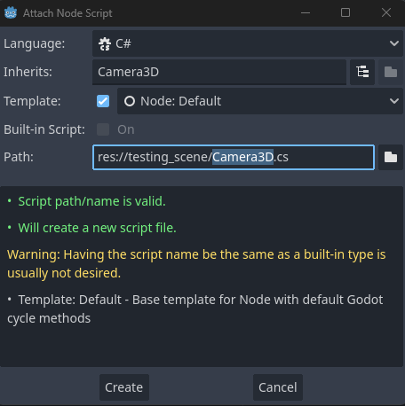

* If you try to run the code, it should give a "Failed to build project" error. This is because we don't have C#'s onnx 
dependencies. Go to [Microsoft OnnxRuntime](https://www.nuget.org/packages/Microsoft.ML.OnnxRuntime) and copy the 
command that is shown, for example:

  ``` 
  dotnet add package Microsoft.ML.OnnxRuntime --version 1.17.3
  ``` 

* If this command gives this error: 
  ``` 
  The command could not be loaded, possibly because:
  * You intended to execute a .NET application:
      The application 'add' does not exist.
  * You intended to execute a .NET SDK command:
      No .NET SDKs were found.
  ``` 
  Go [here](https://dotnet.microsoft.com/en-us/download/dotnet/8.0) and download .NET

* Now insert the created onnx model into the sync path of the test scenario and set Control Mode to Onnx Inference

  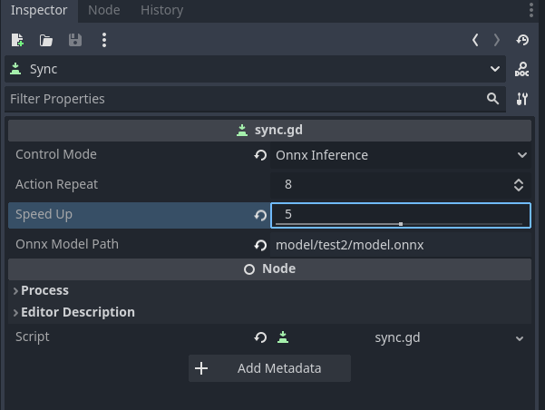

* Set the test scene as the main scene and press the "run project" button or F5. 

  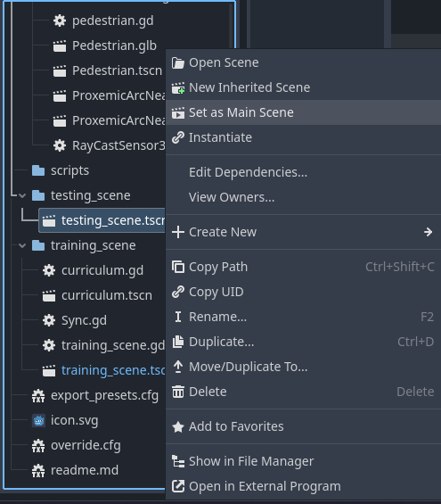
* The test phase environments should start trained using the model created earlier.


