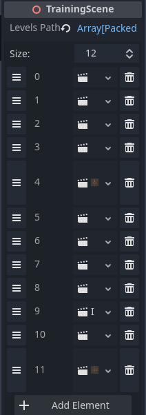
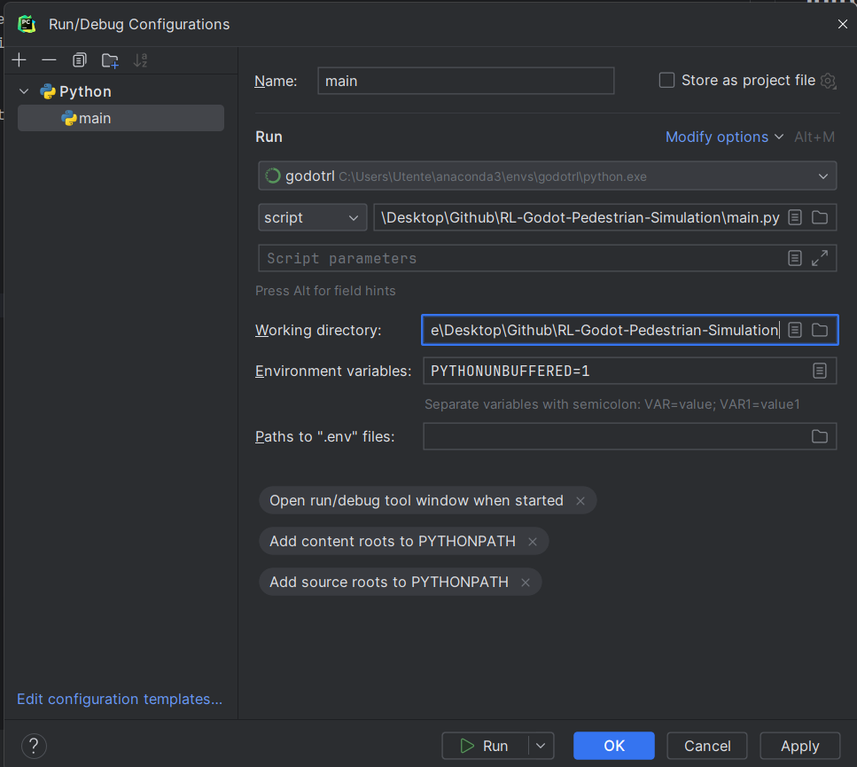
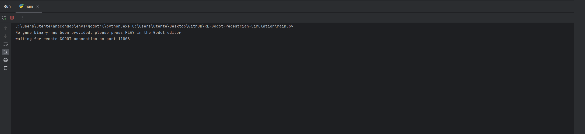
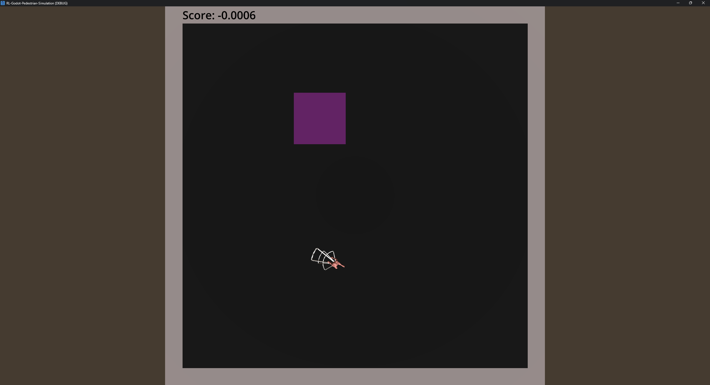
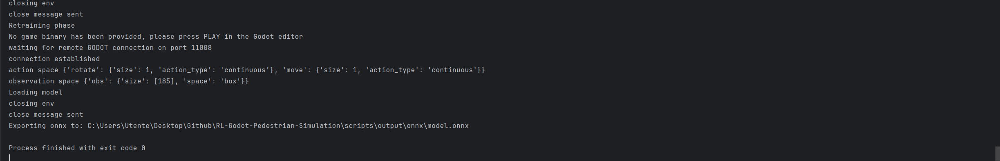
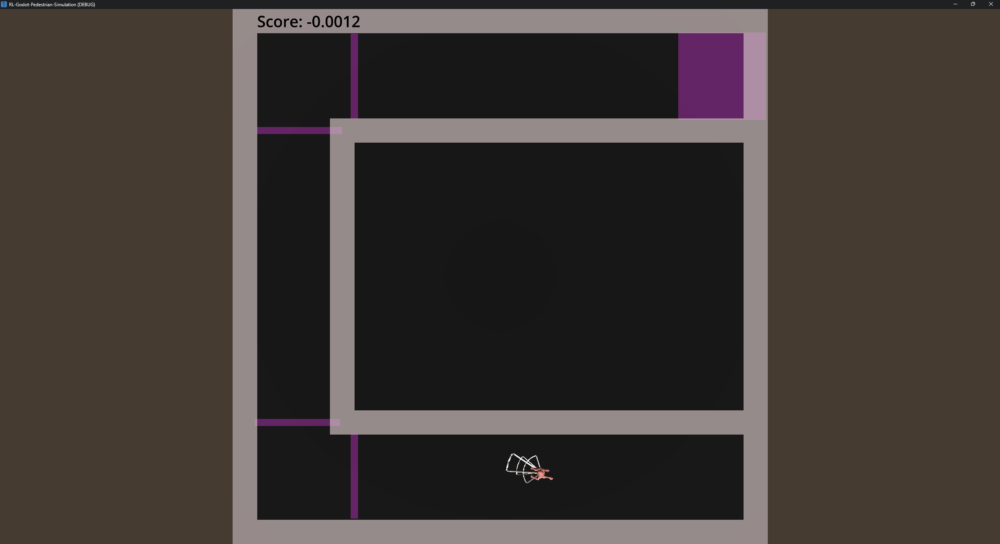
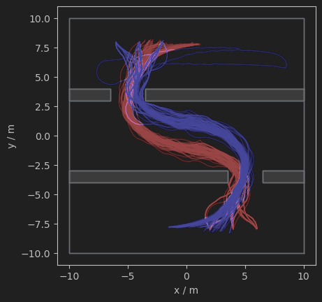

# Getting Started

## Table of Contents

### 1. [Introduction](#introduction)
### 2. [Training Phase](#training-phase)
### 3. [Testing Phase](#testing-phase)
### 4. [Visualize](#visualize)

## Introduction

Welcome to the getting started guide of Godot-RL-Pedestrian-Simulation (**GRLPS**), a tool for pedestrian simulation using 
reinforcement learning in Godot.

This guide will walk you through the initial steps to using GRLPS. You'll learn how to run a training phase, 
execute a testing phase, and visualize pedestrian behaviors and flows during the latter phase.

Before diving into this guide, make sure to read the 
[README](https://github.com/Ruben-2828/RL-Godot-Pedestrian-Simulation/blob/analysis/readme.md) 
first, where you'll find information about the 
tools used, the codebase and the setup of the tool.

Additionally, it's recommended to have a basic understanding of how the tools used work. To assist with this, brief 
documentation for each tool has been created and is available in the project's _docs_ folder. 
For more information, please refer to the documentation for 
[Godot](#https://github.com/Ruben-2828/RL-Godot-Pedestrian-Simulation/blob/analysis/docs/godot_documentation.md) and 
[Godot RL Agents](#https://github.com/Ruben-2828/RL-Godot-Pedestrian-Simulation/blob/analysis/docs/godot_rl_agents_documentation.md).

## Training Phase

### Setting up Godot Engine

Once the tool is open, navigate through the _FileSystem_ to the `training_scene.tscn`, which can be found in the 
_training_ folder. Set this scene as the main scene by right-clicking it in the _FileSystem_ and selecting 
*"Set as Main Scene"*. From the _Scene_ panel, by clicking on the only node present, `TrainingScene`, we'll see on the 
right, in the _Inspector_ panel, the properties of the node. Among these properties, there is `Levels Path`, where you 
can choose the order of environments, add new ones, and delete them. For this experiment, it's recommended not to 
modify this attribute; instructions on how to modify it will be provided in the user guide documentation. Just check 
that the items are present, as shown in the image below.

### Setting up RL

Open an IDE, in this guide, we use PyCharm, but VSCode should work fine as well. Once the project is open, 
click on _Current File_ in the top right, and then select _Edit Configurations_. Once the screen is open, 
create a new Python configuration. As the first parameter, insert the environment where you installed the 
dependencies during setup. In the script field, insert `main.py`. In the working directory, insert the project's path. 
You should get a result similar to the image below.

Remember to click _Apply_ before finishing with the _OK_ button. 
Now we can run the project with the _Run_ command or the shortcut _SHIFT + F10_. 
At this point, the Python server will be waiting for the Godot client and can be viewed from the IDE shell.

### Running Training

Once the server is waiting, we can go back to Godot Engine and run the scene by clicking the _Run Project_ button or 
pressing _F5_. At this point, we should be able to see the training scene running correctly.

## Testing Phase

Once a training phase has been successfully executed without encountering an _Early Fail_, a saved model named 
`model.onnx` will be available in the _scripts/output/onnx_ path. 

Select `testing_scene.tscn` from the _testing_scene_ directory and set it as the main scene. Now, run the project 
within Godot. The testing phase should start, allowing you to visualize the agent's behaviors in scenarios not seen 
during the training phase.

## Visualize

Once the testing phase is complete, you can visualize the trajectories, densities, and speeds within your environments. 
Open the notebook `plotter.ipynb` inside the _scripts_ folder, from your IDE. Run all cells by selecting _Run All_ or 
pressing _Ctrl+Alt+Shift+Enter_. All the plots will then be displayed.

With this guide, you have taken the first steps towards using the Godot-RL-Pedestrian-Simulation (GRLPS) tool for 
pedestrian simulation with reinforcement learning in Godot. You have learned how to set up and run the training and 
testing phases and how to visualize the resulting pedestrian behaviors and flows. If you need further information take a 
look at our `user_guide.md`, where you can get more insight into what GRLPS can do for you!