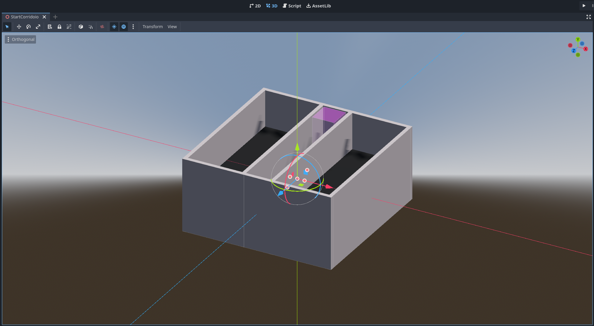
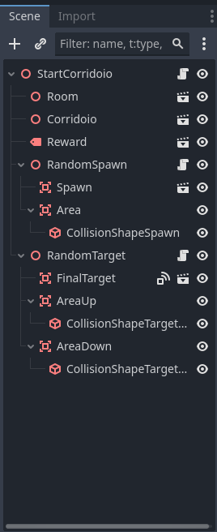

# Godot Engine Documentation

## What is Godot?

Godot is a general-purpose 2D and 3D game engine designed to support a wide range of projects. 
It can be used to develop games or applications for desktop, mobile, or web platforms.

Godot comes with an integrated game editor equipped with various tools such as a code editor, animation tools, lighting 
features, shaders, a debugger, a profiler, and more. Additionally, it supports the integration of external tools, 
for example, allowing the import of 3D scenes from Blender.

## Main elements of Godot

As with any game engine, Godot is built around the concept of abstractions. In Godot, an application is constructed 
using a hierarchical structure of nodes organized within scenes. Each node represents a specific element of the game, 
such as sprites, characters, cameras, or lights. 

Nodes within a scene can be organized and manipulated to create complex interactions and behaviors. They can also 
communicate with each other using signals, which allow events and data to be passed between nodes. 

This hierarchical structure and the communication between nodes through signals form the foundation of how developers 
create and manage the logic and functionality of their games or applications in Godot.

### Scene

A scene in Godot is a reusable collection of nodes within our application. It can represent various elements such as 
characters, menus, environments, entire levels, and more. Scenes in Godot are highly flexible and can also be 
nested within each other, allowing for complex arrangements and compositions of game elements.

### Nodes

A node is the smallest building block, or atom, in Godot, which can be organized into trees. Each node has its own type 
and functionality, and it is possible to attach code to each node to manage its behavior. For example, a node could 
represent a sprite, a camera, a light, or any other element in the game.

When you save a tree of nodes as a scene, it becomes a single node, and its internal structure remains hidden within 
the editor. This modular approach allows for efficient and organized game development, where complex systems can be 
broken down into smaller, manageable components.

### Signals

Nodes can emit specific signals upon the completion of certain actions, enabling them to communicate without being 
hard-wired. Each signal can trigger associated code when emitted. Examples of built-in signals include collision 
management and detection of objects entering specific areas.

This signal-based communication system allows nodes to interact dynamically, responding to events or changes in the 
environment. For example, in game development, when two objects collide, a collision signal can trigger actions such as 
score updates or animations.

## GUI

Godot's Graphic User Interface (GUI) provides a user-friendly environment for designing and interacting with your game 
or application. It offers a range of tools and features to help you create intuitive interfaces for your projects.

### Main Interface

The main interface of Godot is organized into different modes accessible through tabs located at the top of the screen.

#### 2D Mode
In this mode, Godot provides an optimized environment for developing 2D games. It offers an orthographic view of your 
project, allowing you to work directly with 2D elements such as sprites, animations, and tile maps. 
You can easily create and manipulate scenes, set up collision shapes, and manage animations within this mode.

#### 3D Mode
Godot's 3D mode is tailored for working with three-dimensional scenes. Here, you can place and manipulate 3D objects, 
manage lighting and shadows, set up cameras, and utilize other features specific to 3D game development. The interface 
provides views for both perspective and orthogonal projections, allowing for precise control over your 3D environment.

#### Script
In the Script mode, you can write and edit code for your project. Godot supports multiple scripting languages, 
including its own GDScript, VisualScript, and C#. This environment provides features like syntax highlighting, code 
completion, and a built-in debugger, making it easy to write and debug your game logic and functionality.

#### AssetLib
The AssetLib tab gives users access to a library of assets that can be downloaded and integrated into their projects. 
Here, you can find scripts, models, textures, audio files, and other resources contributed by the community. This 
feature simplifies asset management and allows developers to quickly enhance their projects with ready-made content.

### Other Functions and Tools

#### Output
The Output panel displays print output from the code, logging information during game execution, and other system 
messages. It's useful for debugging and understanding what's happening behind the scenes in your project.

#### Debugger
The Debugger panel helps you find and fix errors in your game. It includes features such as breakpoints, step execution, 
and call stack visualization, making it easier to track down and resolve issues in your code.

#### Search Results
After executing a search within the project, the Search Results panel displays the found items. This is helpful for 
quickly navigating to specific files, nodes, or resources within your project.

#### Audio
The Audio panel allows you to manage audio settings for your project, such as mixes and buses. Here, you can adjust 
volume levels, add effects, and organize your audio assets efficiently.

#### Animation
The Animation panel enables you to create and modify animations for various objects and properties in your game. You 
can set keyframes, adjust interpolation curves, and create complex animations to bring your game to life.

#### Shader Editor
The Shader Editor panel lets you write and modify shaders directly within the editor. This powerful tool allows for 
advanced graphical effects and customization, giving you full control over the visual appearance of your game.

### Work Panels

#### Scene
The Scene panel is the heart of level and gameplay creation in Godot. Here, you can organize the hierarchy of nodes that 
compose your scene. Each node can have different components and child nodes, allowing you to build complex scenes with 
ease.

#### Import
After selecting an asset in the FileSystem, this panel allows you to modify the import settings for that specific asset, 
such as texture quality or other import options for 3D models.

#### FileSystem
The FileSystem panel is the project's file explorer where all project files and folders are organized and accessible. 
You can drag and drop resources directly into your scenes or scripts from here.

#### Inspector
In the Inspector panel, you can view and modify the properties of selected nodes in the scene. For each node, 
this panel displays all the properties that can be modified, such as transformations, materials, scripts, and 
exposed variables.

#### Node
The Node panel provides a list of signals and groups associated with the selected node. This is useful for managing 
communication between nodes and membership in specific groups.

#### History
The History panel records recent changes and allows you to navigate through them, similar to the "undo/redo" function 
in many other programs. It helps you keep track of your editing actions and revert changes if needed.

### Execution Controls

Situated in the top right corner of the interface, these controls include:

#### Run Project
Starts the execution of the entire project. This is the standard way to test the game as if it were running in a 
production environment.

#### Pause Project
Temporarily pauses the execution of the project. It's useful for debugging specific moments or behaviors within the game 
without completely stopping the execution.

#### Stop Running Project
Stops the execution of the currently running project. This command returns the user to the editor.

#### Remote Debug
Allows you to connect to a remote instance of the game for debugging. This is particularly useful for testing the game 
on platforms or devices different from those on which the editor is running.

#### Run Current Scene
Starts the execution of the currently open scene in the editor. It's a quick way to test a single scene without having 
to run the entire project.

#### Run Specific Scene
Allows you to select and start the execution of a specific scene without having to navigate to it in the editor.

#### Enable Movie Maker Mode
This is a special command that facilitates recording gameplay sequences or game cinematic, offering optimized controls 
for video capture.

