# User Guide

## Table of Contents

### 1. [Introduction](#introduction)
### 2. [Godot basics](#godot-basics)
### 3. [Level components](#level-components)
### 4. [Creating a new level](#Creating-a-new-level)
### 5. [Adding a level to a curriculum](#Adding-a-level-to-a-curriculum)
### 6. [Modify training configuration](#Modify-training-configuration)
### 7. [View ray casts and arcs of proxemics](#View-ray-casts-and-arcs-of-proxemics)

## Introduction

Welcome to the User Guide for Godot-RL-Pedestrian-Simulation (**GRLPS**), an advanced tool designed for pedestrian 
simulation using reinforcement learning within the Godot game engine.

This comprehensive guide is crafted to lead you through every aspect of GRLPS, from fundamental functionalities to 
advanced features. You'll discover detailed instructions on configuring simulations, interpreting results, and optimizing performance.

## Godot Basics

### StaticBody3D
StaticBody3D is a type of node in Godot Engine used to represent objects that do not move. It is not affected by forces 
such as gravity, but it can interact with other objects through collisions.

In our specific implementation, it has been used as the parent node for two main elements: Wall and Floor.

### Area3D
Area3D is a node in Godot Engine that represents a three-dimensional area in the game world. It is used to detect the 
presence of other objects or characters within it.

In our specific implementation, it has been used as the parent node for two main elements: Target and Spawn.

### CollisionShape3D
CollisionShape3D is a node used in Godot Engine to define the collision geometry for physical nodes like StaticBody3D 
or Area3D. This node is crucial for establishing the physical interactions of objects in the virtual world.

In our specific implementation, CollisionShape3D has been employed as a child node for all structural elements of the 
environments, such as floors, walls, target area, and spawn area. For each element, we configured the 'shape' property 
of the node as BoxShape, adjusting the dimensions according to the specific needs of each context.

### MeshInstance3D
MeshInstance3D is a node in Godot Engine that allows for the display of 3D meshes in the game environment, primarily 
for the visual representation of physical nodes like StaticBody3D or Area3D.

In our specific implementation, we have used MeshInstance3D as a child node for all structural elements of the 
environments, such as floors, walls, spawn area, and target area. For each element, we configured the 'mesh' property 
as BoxMesh to define the shape and then used the Material parameter to create the material of the element. We customize 
the color of the material by modifying the Color parameter in the Albedo section for each mesh.

### Label3D
In Godot Engine, Label3D is a node used to display text in a 3D scene. In our specific implementation, it has been used 
to show the reward of the specific environment at runtime.

### CharacterBody3D
CharacterBody3D is a specialized class for physical bodies designed to be controlled by the user. It is used for highly 
configurable physical bodies that need to move in specific ways and interact with the surrounding environment.

In our specific implementation, CharacterBody3D is employed to provide a representation of the character and to control 
its movement, orientation, and vision within the environments it is placed in.

### WorldEnvironment
WorldEnvironment is a node in Godot Engine used to control the global rendering environment settings in a 3D scene. 
Parameters such as lighting, sky color, fog, bokeh effect, and more can be adjusted.

### DirectionalLight3D
DirectionalLight3D is a node in Godot Engine used to simulate a directional light source in a 3D scene.

### Camera3D
Camera3D is a node in Godot Engine used to represent a three-dimensional camera in the game scene.

In our specific implementation, it has been used within TrainingScene to display one environment at a time through a 
top-down orthographic perspective.

### Sync 
Sync is not a node found in Godot Engine, but has been introduced by the Godot RL Agents library. Its purpose is to 
synchronize the scene running in Godot with the neural network trained in Python. This node manages the communication 
between Python and Godot over TCP.

### Collision Layer and Collision Mask

The collision layer describes the layers in which the object exists. By default, all bodies are on layer 1.
The collision mask describes which layers the body will check for collisions. If an object isn't in one of the mask 
layers, the body will ignore it. By default, all bodies check layer 1. In godot there are 32 collision layers and 
each one can be renamed.

### Groups
Groups in Godot function similarly to tags in other software. 
You can add a node to as many groups as you wish. Then, in code, you can use the SceneTree to:

* Obtain a list of nodes in a group.
* Invoke a method on all nodes in a group.
* Dispatch a notification to all nodes in a group.

## Level Components

### Groups
In this project there are 4 main groups:
* Pedestrians group assigned to each pedestrian, default value: 'PEDESTRIAN'
* Targets group assigned to each target, default value: 'TARGET'
* Obstacles group assigned to each obstacle, default value: 'WALL'
* AiControllers group assigned to each ai controller, default value: 'AGENT'

   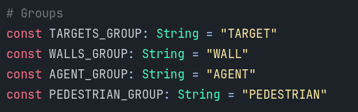

### Collision layers
The first 6 layers are used and renamed:
* Layer 1, renamed to 'wall': assigned to obstacles
* Layer 2, renamed to 'pedestrian': assigned to every pedestrian
* Layer 3, renamed to 'pedestrian_group_1': assigned only to pedestrians of group 1
* Layer 4, renamed to 'pedestrian_group_2': assigned only to pedestrians of group 2
* Layer 5, renamed to 'target_group_1': assigned only to targets of group 1
* Layer 6, renamed to 'target_group_2': assigned only to targets of group 2

   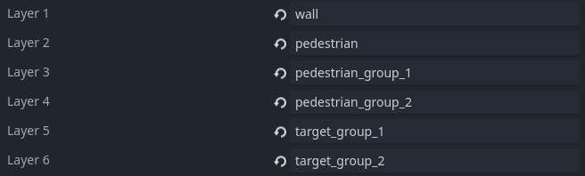

In certain scenarios there could be two pedestrian flows, each one with different targets, so to distinguish them the
layers 3, 4, 5 and 6 have been used. Each pedestrian must be in layer 2 and in only one between layer 3 or 4. Each 
target must be in at least one target layer (5 or 6), but can be in both too (e.g. two different pedestrian groups has
the same final target). Layers above the sixth could be used if there are more than two pedestrian groups.

### Target
A target is an objective that the agent must reach. 

  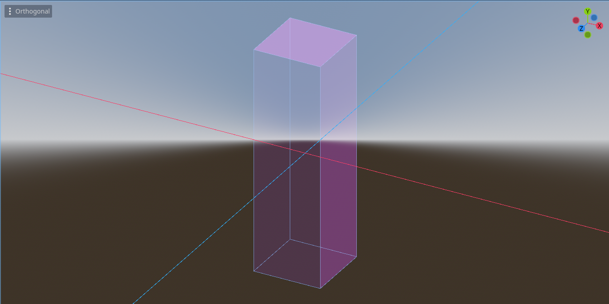

There are two types of targets:
* Intermediate Targets: Help guide the agent in complex environments where the final target is not directly visible. 
    The agent can pass through these. 
* Final Targets: The ultimate goal that the agent strives to reach.

To create a new target follow these steps: 
1. Create a new scene
2. Set as root a node of type Area3D
3. Add two children nodes of type MeshInstance3D and CollisionShape3D
4. To the MeshInstance3D node set a new mesh and its dimensions, rotation and the target material
5. To the CollisionShape3D node set a new collision shape and its dimensions and rotations
6. Make sure the dimensions and rotations of these two nodes are the same
7. Add the target group (*TARGET*) to the root node
8. Attach the script `target.gd` to the root node
9. On the root node under the section Collision deactivate all the layers in Layer and Mask sections

### Obstacle
An obstacle is a barrier that the agent cannot pass through.

  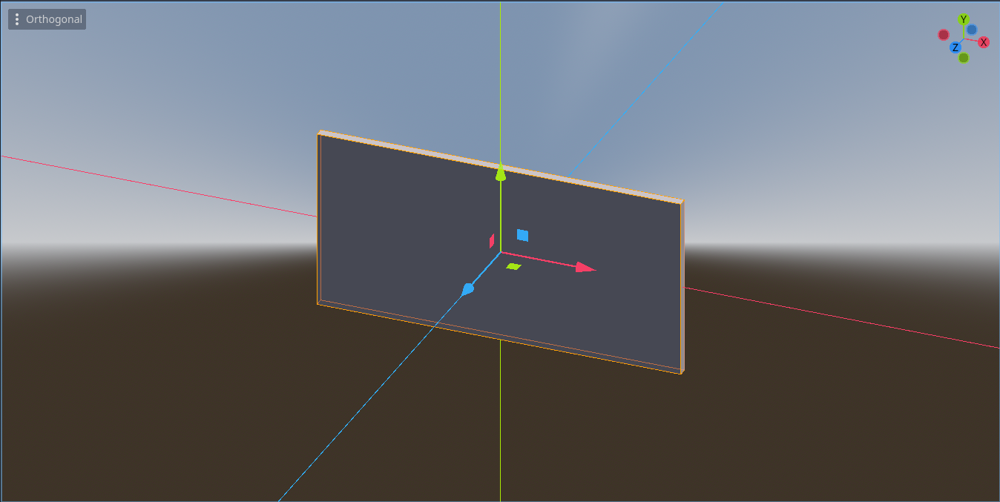

To create a new target follow these steps:
1. Create a new scene
2. Set as root a node of type StaticBody3D
3. Add two children nodes of type MeshInstance3D and CollisionShape3D
4. To the MeshInstance3D node set a new mesh and its dimensions, rotation and the obstacle material
5. To the CollisionShape3D node set a new collision shape and its dimensions and rotations
6. Make sure the dimensions and rotations of these two nodes are the same
7. Add the obstacle group (*WALL*) to the root node
8. On the root node under the section Collision activate layer 1 in section Layer and layer 1 and 2 in section Mask

### Pedestrian

The pedestrian is the agent in our environment that must reach the final target maximizing the obtained reward. 
The pedestrian default settings can be found in the file `constants.gd` in `utils` directory

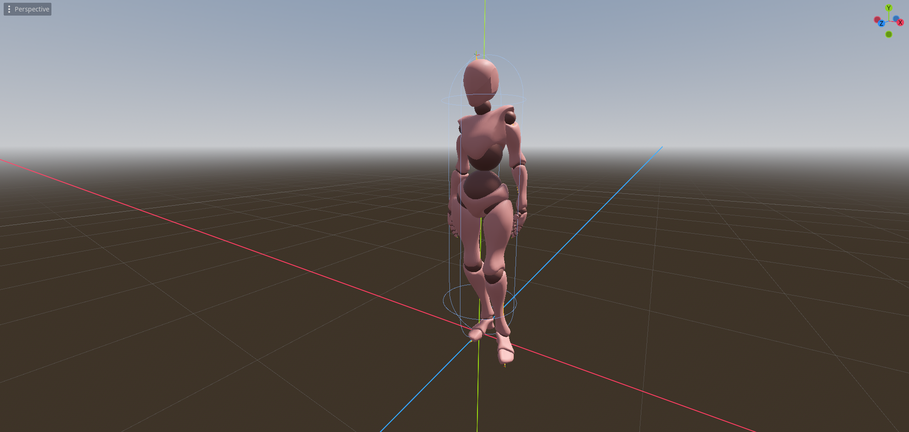

### Other
  
In this section there are the elements that don't fall in the previous categories. They are:

* Floor: Used to define the floor of the environment. The agent cannot pass through it
    
    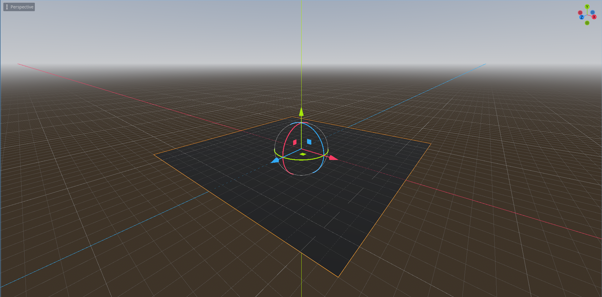

* Reward: Label used to print the reward value during the execution

* Room: A scene composed of the floor and four walls. It is used as a base for each scenario
    
    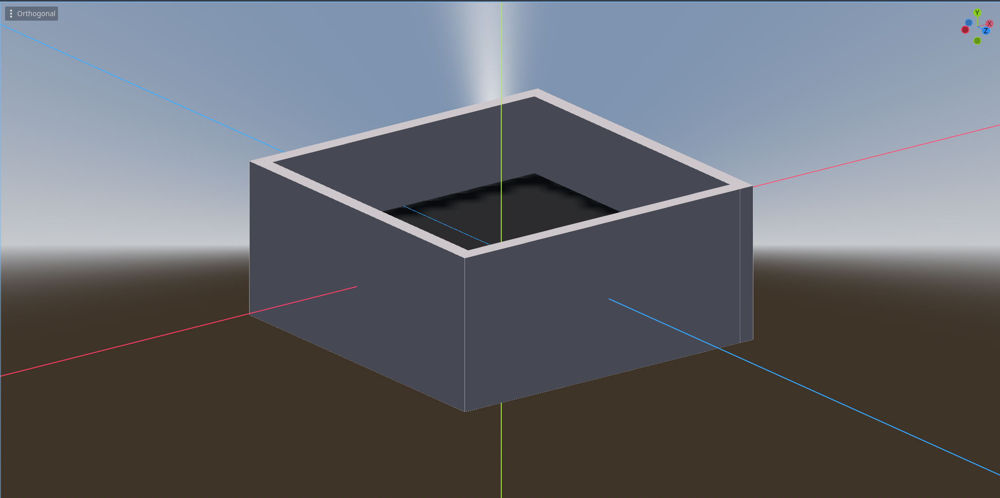

## Randomization

### Random Pedestrian Spawn
To randomize the spawn position within a given area, follow this structure:
* If you want to randomize the agent rotation, click the parent node. Once you've made sure it has the level script, enable Agent Rotate
*  Inside the level, insert an Area3D. Rename this node to RandomArea .
*  Inside the Area3D, insert a CollisionShape3D and set the size of the spawning area using a BoxShape. Rename this 
node to CollisionShapeSpawn.
* Inside the level, insert a Node3D, rename this node PedestrianController. Attach the script `PedestrianController`. 
* Add the Pedestrian inside the PedestrianController. Now the pedestrians will spawn at random in the given area
* The result should look like this:

  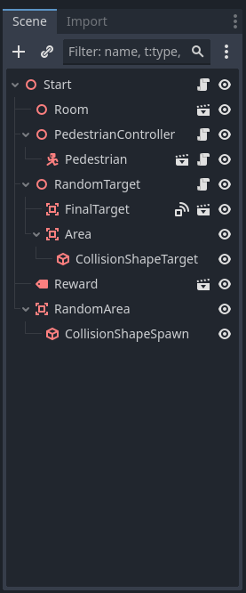

### Random Final Target
To randomize the position of the final target within a given area, follow this structure:
* Use a Node3D as the parent node for the final target and the area in which it can spawn. Attach the script 
`randomizer.gd`. It’s recommended to rename it to RandomTarget, but this is not mandatory.
* Click on the node and select which attribute to randomize: position and rotation
* Insert the node labeled FinalTarget as a child. Do not change the name.
* Insert an Area3D node. It is not strictly necessary to rename it.
* Inside the Area3D, insert a CollisionShape3D and set the size of the final target area using a BoxShape. 
Rename this node to CollisionShapeTarget.
* The result should look like this:

    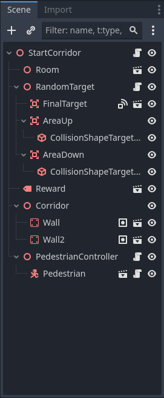

### Random Passage Target
To randomize the position of a passage within a given area, follow this structure:
* Use a Node3D as the parent node for the final target and the area in which it can spawn. Attach the script 
`randomizer.gd`. It’s recommended to rename it to RandomPassage, but this is not mandatory.
* Click on the node and select which attribute to randomize: position and rotation
* Insert the node labeled Passage as a child. Do not change the name.
* Insert an Area3D node. It is not strictly necessary to rename it.
* Inside the Area3D, insert a CollisionShape3D and set the size of the final target area using a BoxShape. 
Rename this node to CollisionShapePassage.
* The result should look like this:

    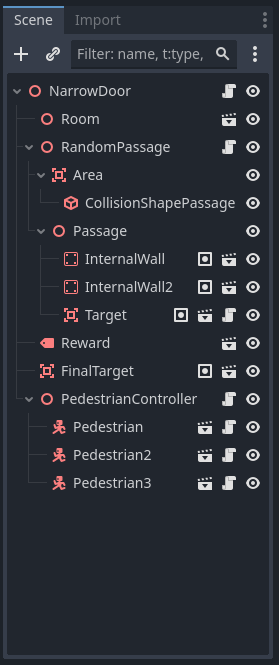

## Creating a new level

### Create the level

To create a new level follow these steps: 

1. Follow the path _environments/levels/_ and select training or testing according to your needs. 
2. From here click with the right mouse button and select "Create New" and then "Scene"
3. Name the scene and select 3D Scene as the Root Type

    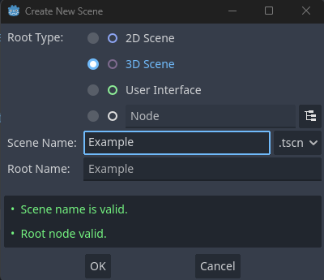

4. Once the scene is created, right-click on the parent node and select "Attach Script". Enter the path of the level.gd script

    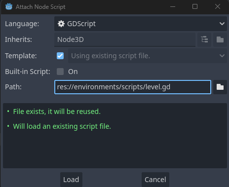
5. Now, from the FileSystem we insert rooms, rewards, targets and obstacles, positioning them as we like
6. Once added the element, let's insert a 3D node and call it PedestrianController. On this, we click "Attach Script" 
and insert the PedestrianController code. We insert as children all the Pedestrian nodes necessary for the new level. 

    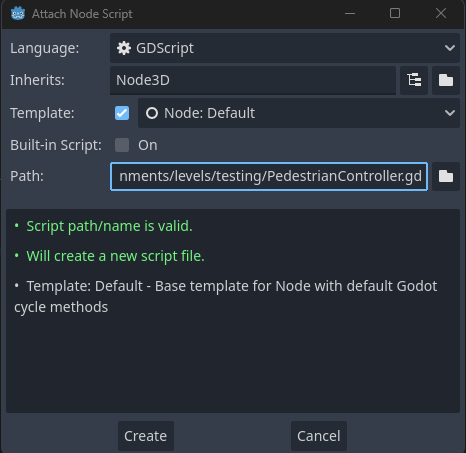
7. Then, follow all the other instructions provided for element randomization, collision layer and mask of pedestrian and final target.
8. The structure of the new level should be something like this:

    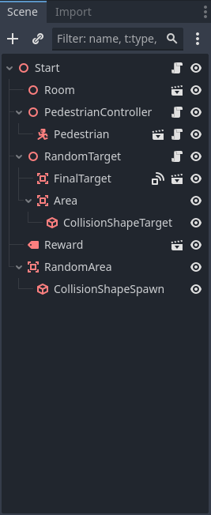

### Create the batch level

Once you create a layer, you need to batch the layer.

1. Enter the testing or training folder, according to your needs, and then the batch folder.
2. Create the scene with the layer name and the Batch keyword.
3. Click on the parent node and click Attach Script. Select the path of `level_training_batch` or `level_testing_batch`
4. Click on the parent node and from the Inspector panel insert the created base level.

    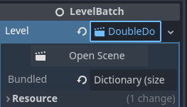
5. Next, insert the Sync, WorldEnvironment, DirectionalLight3D, and Camera3D nodes as children. 
You can do this by copying them from another batch layer.
6. Make sure the sync node has Control Mode = Onnx Inference if the layer is used in the testing 
phase and Control Mode = Training if the layer is used in the training phase
7. The structure of the new batch level should be something like this:

    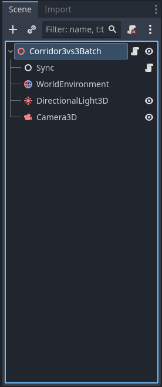

## Adding a level to a Curriculum

To view the curriculum or add a new scenario, proceed as follows:

1. Open the desired scene using Godot's FileSystem. Select the scene you want to
modify, such as `training_scene.tscn` or `testing_scene.tscn`.

2. Once the scene is open, use the Scene panel in the upper left corner to view the nodes that make up the scene. 
Click on the main node, which could be TrainingScene or TestingScene. This will display the node's attributes in the 
Inspector panel, located on the right side.

3. In the Inspector, locate the Levels attribute. Here you can decide how many and which scenarios to load, 
simply by clicking on "Add Element" and then "Load" or "Quick Load". Remember to enter the level batch and not the normal level!

    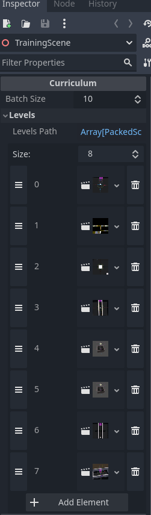
4. Once the batch has been inserted it is necessary to open the project with an IDE.

5. Once opened, enter the scripts folder and then the configs folder

6. Here is a YAML file with all the environments. Insert the new environment with termination metrics into the curriculum

   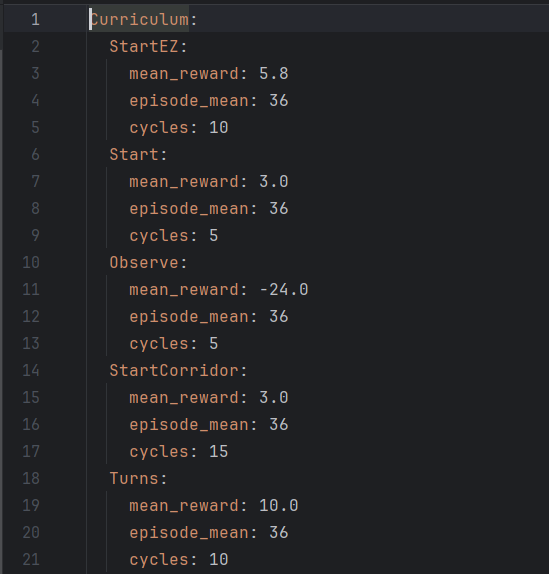

## Modify training configuration

1. To modify the training configurations you need to open the project with an IDE.

2. Once opened, enter the scripts folder and then the configs folder

3. Here is a YAML file with all the environments. Here you can change the termination metrics into the curriculum

4. If you want to modify other attributes such as the duration of the retraining phase, open the constants file in the utils folder

5. If you want to modify the parameters relating to the ppo open the file runner

## View ray casts and arcs of proxemics

To enable the visualization of ray casts as your code executes, navigate to the `constants.gd` file and ensure that the 
variable `SHOW_RAYS` is set to `true`. This adjustment will display arcs representing proxemics and the trajectory of 
ray casts both during the training and testing phases.

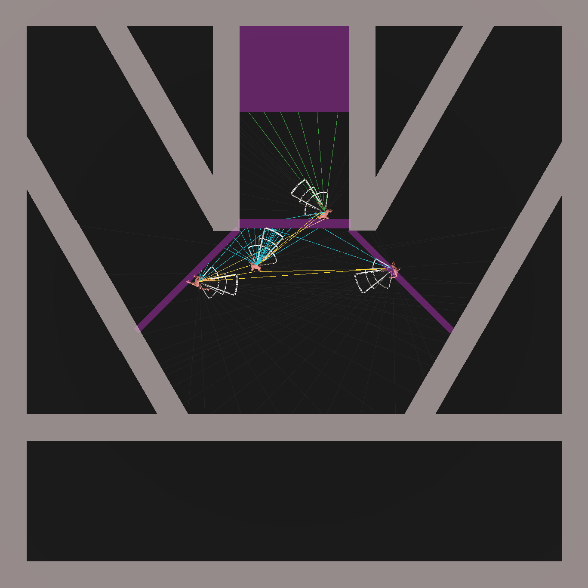