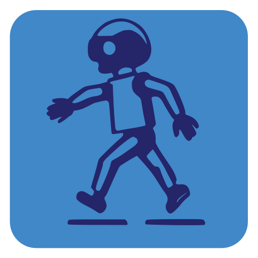

<h1 style="text-align: center;">RL-Godot-Pedestrian-Simulation</h1>

<h3 style="text-align: center;">Curriculum–Based Reinforcement Learning for Pedestrian Simulation</h3>

<div style="text-align: center">

</div>


<h6 style="text-align: center;">Tenderini Ruben - Falbo Andrea </h3>

## Table of Contents

### 1. [Objective](#objective)
### 2. [Tools](#tools)
### 3. [Documentation](#documentation)
### 4. [Setup](#setup)
### 5. [Codebase](#codebase)
### 6  [Collaborate](#collaborate)

## Objective

The primary objective of this project was to explore the application of *Reinforcement Learning* (RL) in the field of 
*pedestrian and crowd simulation*. Specifically, the project aimed to develop intelligent agents capable of realistically 
simulating pedestrian behaviors in various environments. 

Unlike traditional models that rely on predefined algorithms or force interactions, this project utilized RL to 
train agents in an unsupervised manner, focusing on the ability of these agents to generalize their learning to 
handle new, unseen scenarios effectively.

A key aspect of the project was to ensure that these agents not only achieve their set goals but also mimic human 
behavior as closely as possible within the constraints of their environment.

Our approach includes creating a progressively challenging *curriculum* to aid the agent in acquiring complex pedestrian 
behaviors such as orientation, walking, and interacting with other pedestrians in a simulated environment. 

The framework employs the *Godot* engine and the *Godot-RL-Agents* plugin for the implementation and testing of the 
simulation and PedPy for visualizing and analyzing pedestrian trajectories.

## Tools

The main tools and methodologies used to conduct this project are provided below:

### Godot Engine
[**Godot Engine**](https://godotengine.org/) is a feature-packed, cross-platform game engine to create 2D and 3D games from a unified interface.

### Godot-RL-Agents
[**Godot-RL-Agents**](https://github.com/edbeeching/godot_rl_agents) is a fully Open Source package that allows video game creators, AI researchers and hobbyists 
the opportunity to learn complex behaviors for their Non Player Characters or agents.

### Stable Baselines 3

[**Stable Baselines 3**](https://github.com/DLR-RM/stable-baselines3) is a set of reliable implementations of 
reinforcement learning algorithms in PyTorch. It is the next major version of Stable Baselines. 

### PedPy

[**PedPy**](https://pedpy.readthedocs.io/en/stable/#)  is an open source, MIT-licensed Python library for pedestrian 
movement analysis. It provides a high-level interface for extracting fundamental measurements from trajectory data.

## Documentation

<h3>Getting Started</h3>
<p>New here? Check out the <a href="docs/getting_started.md">
<strong>Getting Started</strong></a> documentation.</p>


<h3>User Guide</h3>
<p>For a detailed exploration of all the features and capabilities of the tool, 
please refer to the <a href="docs/user_guide.md"><strong>User Guide</strong></a></p>


<h3>What is Godot?</h3>
<p>To learn about the engine behind the project, consult the 
<a href="docs/godot_engine.md"><strong>Godot</strong></a></p>


<h3>What is Godot RL Agents?</h3>
<p>To learn about the technologies behind the project consult the 
<a href="docs/godot_rl_agents.md"><strong>Godot RL Agents</strong></a> documentation.</p>


## Setup

### Windows

Here's the setup for Windows:

#### Open the project on Godot

1. **Clone this repository**: Clone this repository 
    ```
    https://github.com/Ruben-2828/RL-Godot-Pedestrian-Simulation.git
    ```
2. **Install Godot**: You can download and install Godot from [here](https://godotengine.org/download/windows/)! 
It is recommended to download the mono version (.NET) as it will be necessary in a second phase of using this tool.

3. **Launch Godot**: Extract the files and run the Godot exe. The godot engine will open

4. **Import Project**: In the launcher, press Import and find this repository. Then press Import & Edit. 
Now the project should be open!

#### Enable RL to Godot

1. **Install Anaconda**: We recommend installing anaconda to have a complete and integrated environment. You can do it 
from [here](https://www.anaconda.com/download)!

2. **Create an environment**: Open Anaconda Prompt and create an environment with python 3.10:
    ```
    conda create --name myenv python=3.10
    ```
3. **Activate the environment**: After creating the environment, you need to activate it using the following command:
    ```
    conda activate myenv
    ```
4. **Install the dependencies**: You can install the dependencies of this project using this following commands:
    ```
    pip install godot-rl
    ```
    ```
    pip install stable-baselines
    ```
    ```
    pip install pedpy
    ```

5. If you try to run the code, it should give a "Failed to build project" error. This is because we don't have C#'s onnx 
    dependencies. Go to [Microsoft OnnxRuntime](https://www.nuget.org/packages/Microsoft.ML.OnnxRuntime) and copy the 
    command that is shown, for example:

    ``` 
    dotnet add package Microsoft.ML.OnnxRuntime --version 1.17.3
    ``` 

    If this command gives this error: 
    ``` 
    The command could not be loaded, possibly because:
    * You intended to execute a .NET application:
      The application 'add' does not exist.
    * You intended to execute a .NET SDK command:
      No .NET SDKs were found.
    ``` 
    Go [here](https://dotnet.microsoft.com/en-us/download/dotnet/8.0) and download .NET SDK


## Codebase
To have a better understanding of the location of the files within the repository, we recommend reading this section.

```
RLGPS
├── docs
├── godot
│   ├── addons
│   ├── environments
│   │   ├── levels
│   │   │   ├── testing
│   │   │   └── training
│   │   └── scripts
│   │   │   └── randomizer
│   ├── materials
│   ├── objects
│   │   ├── other
│   │   ├── pedestrian
│   │   ├── targets
│   │   └── walls
│   ├── testing
│   │   └── batch
│   ├── training
│   │   └── batch
│   └── utils
├── notebooks
├── output
│   ├── logs
│   ├── models
│   ├── pedpy
│   └── runs
├── scripts
│   ├── configs
│   ├── models
└── └── utils

```
* **docs**: contains project documentation
* **godot**: contains all the godot files
  * **addons**: imported from Godot RL agents
  * **environments**: contains the scenes and codes relating to the environments
    * **levels**: contains scenes that can be inserted into CVs
      * **testing**: contains scenes used during the testing phase
      * **training**: contains scenes used during the training phase
    * **scripts**: contains the codes relating to the levels
      * **randomizer**: contains codes to randomize objects within levels
  * **materials**: contains the materials of the objects used in the levels
  * **objects**: contains the objects used in the levels
    * **other**: contains miscellaneous objects that do not fit into the standard categories
    * **pedestrian**: contains all data and assets related to the pedestrian models
    * **targets**: contains target used to define goals within the simulation
    * **walls**: contains all the walls used in the levels
  * **testing**: contains the scenes and codes relating to the testing phase
    * **batch**: contains the batches of layers used during the testing phase
  * **training**: contains the scenes and codes relating to the training phase
    * **batch**: contains the batches of layers used during the training phase
  * **utils**: contains utility gd scripts that support various functionalities
* **notebooks**: contains python notebooks used for plotting results
* **output**: contains the outputs generated by the tool
  * **logs**: contains logs created by sb3's VecMonitor class
  * **models**: contains the onnx models trained during the training phase
  * **pedpy**: contains the txt generated by the tool that will be used in the plotter
  * **runs**: contains the generated files viewable via tensorboard
* **scripts**: contains all the python scripts related to the project 
  * **configs**: contains YAML configuration file for scripts and environments
  * **models**: contains the python models used by the tool
  * **utils**: contains utility python scripts that support various functionalities

## Collaborate

If you encounter any errors or have suggestions for improvements, we welcome collaboration and feedback from the 
community. You can contribute by:

* **Reporting Issues**: If you come across any [issues](https://github.com/Ruben-2828/RL-Godot-Pedestrian-Simulation/issues) 
or discrepancies, please don't hesitate to report them. Your prompt reporting is essential for addressing these issues efficiently and maintaining optimal functionality.

* **Pull Requests**: Feel free to submit [pull requests](https://github.com/Ruben-2828/RL-Godot-Pedestrian-Simulation/pulls) 
with fixes, enhancements, or new features. We appreciate any contributions that improve the project.

Collaboration is essential for the continued development and improvement of this project. Let's work together to make it even better!
